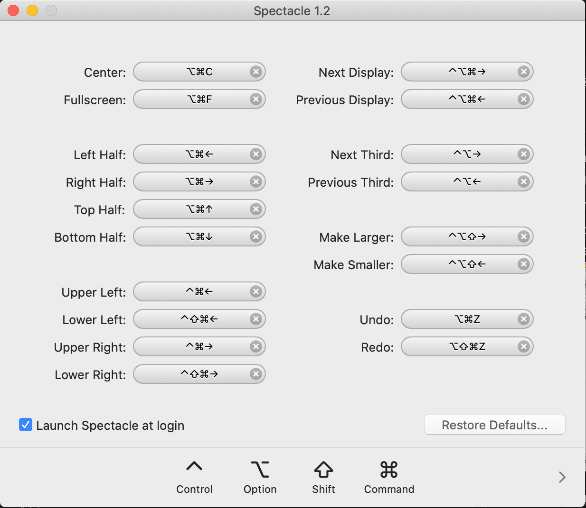
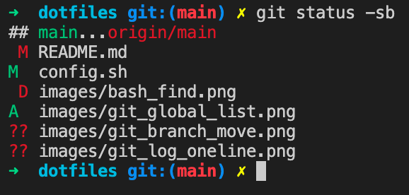
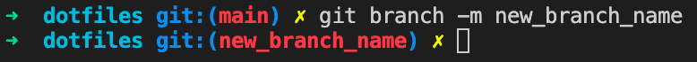
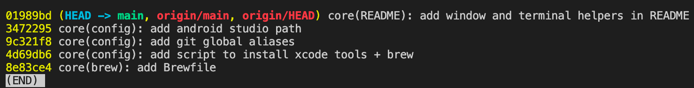
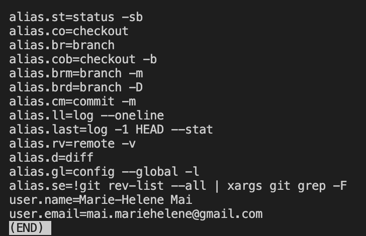
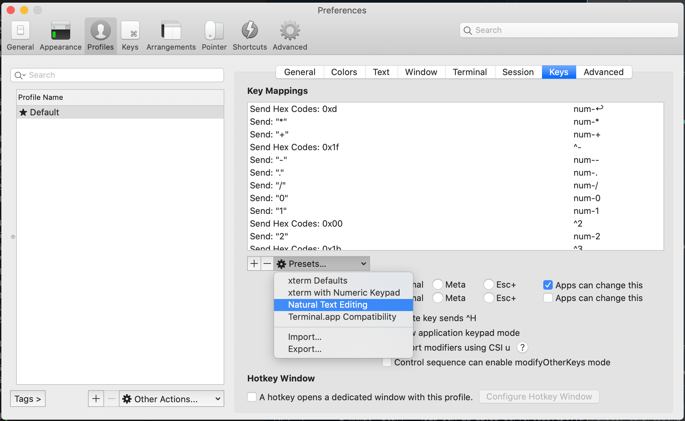
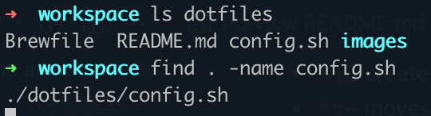

# dotfiles

- [Setup](#setup)
  - [Install tools with Brewfile](#install-tools-with-brewfile)
  - [Organize windows with Spectacle](#organize-windows-with-spectacle)
  - [Git](#git)
    - [Git user config](#git-user-config)
    - [Git aliases](#git-aliases)
    - [Git rebase](#git-rebase)
  - [iTerm2 terminal](#iterm2-terminal)
    - [Auto-suggestions with zsh](#auto-suggestions-with-zsh)
    - [Natural Text Editing](#natural-text-editing)
    - [Editing shortcuts](#editing-shortcuts)
    - [Tab/Pane Switching shortcuts](#tabpane-switching-shortcuts)
    - [Common bash/zsh commands and shortcuts](#common-bashzsh-commands-and-shortcuts)

## Setup

### Install tools with Brewfile

- Install **Homebrew**

  ```
  /bin/bash -c "$(curl -fsSL https://raw.githubusercontent.com/Homebrew/install/HEAD/install.sh)"
  ```

- Install `brew bundle` command

  ```
  brew tap Homebrew/bundle
  ```

- Adapt [Brewfile](https://github.com/mariehmai/dotfiles/blob/main/Brewfile) to your need and run
  ```
  brew bundle
  ```

### Organize windows with Spectacle

> ⬇️ Can be installed with [Brew](#install-tools-with-brewfile)

This is an app to move and resize windows.



**Shortcuts**

- `⌘⌥←` moves the window to the **left** and resizes it to half size, then 2/3, then 1/3 on repeat
- `⌘⌥→` moves the window to the **right** and resizes it to half size, then 2/3, then 1/3 on repeat
- `⌘⌥↑` moves the window to the **top** and resizes it to half size, then 2/3, then 1/3 on repeat
- `⌘⌥↓` moves the window to the **bottom** and resizes it to half size, then 2/3, then 1/3 on repeat
- `⌘⌥f` resizes the window to full screen

### Git

> ⬇️ Can be installed with [Brew](#install-tools-with-brewfile)

#### Git user config

```
git config --global user.name 'Marie-Helene Mai'
git config --global user.email 'mai.mariehelene@gmail.com'
```

#### Git aliases

```
git config --global alias.co 'checkout'
git config --global alias.cob 'checkout -b'
git config --global alias.br 'branch'
git config --global alias.brm 'branch -m'
git config --global alias.brd 'branch -d'
git config --global alias.brD 'branch -D'
git config --global alias.cm 'commit -m'
git config --global alias.st 'status -sb'
git config --global alias.ll 'log --oneline'
git config --global alias.last 'log -1 HEAD --stat'
git config --global alias.rv 'remote -v'
git config --global alias.d 'diff'
git config --global alias.gl 'config --global -l'
git config --global alias.se '!git rev-list --all | xargs git grep -F'
```

- `git status -sb` displays the state of the working directory and the staging area in a more concise way
  
- `git checkout -b <new_feature_branch>` creates a new branch <new_feature_branch> from the current one and checks out to it
- `git branch -m <new_branch_name>` renames the current branch to `<new_branch_name>`

  

- `git log --oneline` lists the commits history in single line
  
- `git config --global -l` lists all the global configs
  
- `git fetch -p && for branch in $(git for-each-ref --format '%(refname) %(upstream:track)' refs/heads | awk '$2 == "[gone]" {sub("refs/heads/", "", $1); print $1}'); do git branch -D $branch; done` removes the local branches that not matching ins the remote

#### Git rebase

Rebasing a branch puts your commits on top the base branch. This allows to keep a clean history and helps investigating regression when checking `git log`.

**`git rebase <base>`**

**Steps**

- Create a `<new_branch>` from the `<base>`
- Checkout to the `<base>`
- Add additional commits
- The `<new_branch>` is now behind the `<base>`
- Checkout `<new_branch>`
- Run `git rebase <base>`, fix the conflicts if any and continue until the HEAD is ahead of `<base>`

**`git rebase -i|--interactive`**

### iTerm2 terminal

> ⬇️ Can be installed with [Brew](#install-tools-with-brewfile)

#### Auto-suggestions with zsh

- Install **Oh My Zsh**

  ```
  sh -c "$(curl -fsSL https://raw.github.com/ohmyzsh/ohmyzsh/master/tools/install.sh)"
  ```

- Install the `zsh-autosuggestions` plugin

  ```
  git clone https://github.com/zsh-users/zsh-autosuggestions ${ZSH_CUSTOM:-~/.oh-my-zsh/custom}/plugins/zsh-autosuggestions
  ```

- Add the plugin in the **zsh** config file
  - Open the file `vim ~/.zshrc`.
  - Find the line starting with `plugins=` that contains other plugins and add the `zsh-autosuggestions` plugin.
    > 💡 In **vim** navigation mode, you can type `/plugins=` to search the nearest occurrence of `plugins=` then `n` to go to the next.
  ```
  plugins=(
    ...
    zsh-autosuggestions
  )
  ```
  - Exit **vim** insertion mode `ESC` then `:wq` to save and quit.
- Apply the changes `source ~/.zshrc`.
- Start typing any command in the terminal. You should now see the suggestion and using `→` key will confirm the suggestion.
  

#### Natural Text Editing

> 💡 This allows you to benefit from some shortcuts to navigate easier in the terminal that are not available by default by iTerm2.

- Go to _iterm2 > Preferences > Profiles > [Profile Name | default] > Keys > Presets_
  

#### Editing shortcuts

- `⌥←` jumps to previous word
- `⌥→` jumps to next word
- `⌃←` jumps to start of line (can conflict with Spectacle shortcuts, can use default terminal `⌃a` instead)
- `⌃→` jumps to end of line (can conflict with Spectacle shortcuts, can use default terminal `⌃e` instead)

#### Tab/Pane Switching shortcuts

- `⌘D` creates a new pane horizontally
- `⌘⇧D` creates a new pane vertically
- `⌘[` switches to previous pane
- `⌘]` switches to next pane
- `⌘T` creates a new tab
- `⌘⇧←` moves current tab to left
- `⌘⇧→` moves current tab to right
- `⌘⇧[` switches to previous tab
- `⌘⇧]` switches to next tab
- `⌘1|2|n` switches to tab `1|2|n`

#### Common bash/zsh commands and shortcuts

- `⌃r [previous_command_to_search]` gets the first matching entry in the history. By repeating `⌃r`, it gives the following matching entries.
- `⌥⌫` deletes word by word
- `⌘⌫` deletes whole line
- `find [path from where to start the search] [-options] [what to find]` searches files or directories
  

- `which` locates a command by searching the executable in the directories specified by the `PATH`
